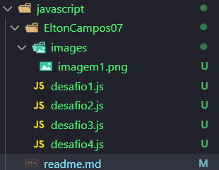
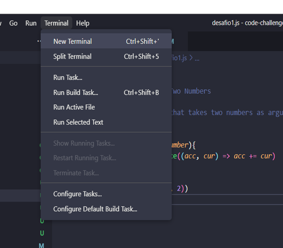
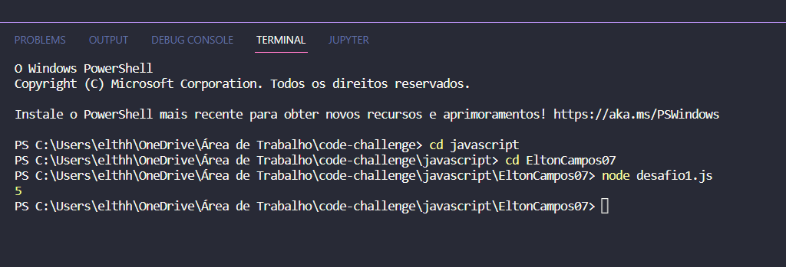

# Projeto Pokédex(UP)
🚀 Desafio proposto pela comunidade SouJunior.   
(Desafios para Hacktoberfest 👨‍💻) 🚀

# Desafios:

Desafio 1 - Return the Sum of Two Numbers. 
Desafio 2 - Football points. 
Desafio 3 - Reverse an Array. 
Desafio 4 - Area of a Rectangle. 

# Informações:

* Desafio realizado em Javascript 🧑‍🎓

# Execução dos desafio:

É necessário possuir o NodeJs instalado

NodeJs: https://nodejs.org/pt-br/download/

Dentro da pasta Javascript há uma subpasta com o nome "EltonCampos07" e nela você encontrá a resolução dos desafios.

A maneira de executar o arquivo contendo o desafio é exatamente igual para os demais.

## Utilizando NodeJs:

Etapa 1 - Seleciona o desafio no qual você deseja executar:
Etapa 2 - Abre o terminal:

Na parte superior do Visual Studio Code, você encontrará alguns opções. Você deve selecionar a opção "Terminal" conforme a imagem de exemplo:

Etapa 3 - Execute o código:

No terminal que foi aberto no VS code (etapa anterior), você deverá digitar node ["nome do arquivo.js"] conforme a imagem:

Uma vez feito isso, o programa será executado e apresentará no terminal o retorno da função.

obs.: certifique-se de que você esteja na pasta onde os desafios estão salvos.
Se não estiver, você deverá utilizar o comando cd + "nome da pasta" para navegar entre as pastas até chegar o diretório correto.

### Meus contatos: 
* https://www.linkedin.com/in/eltonapcampos/

